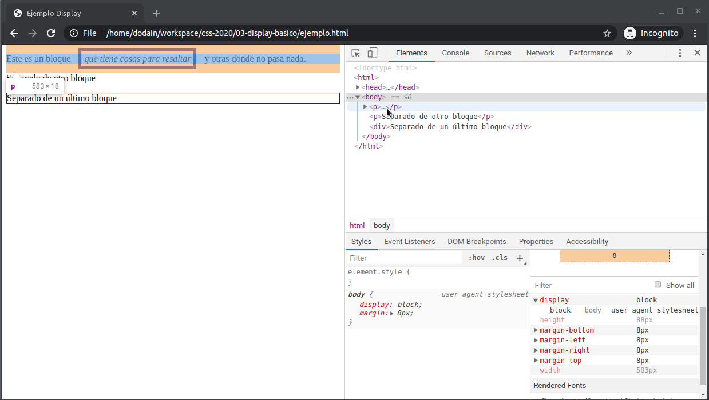
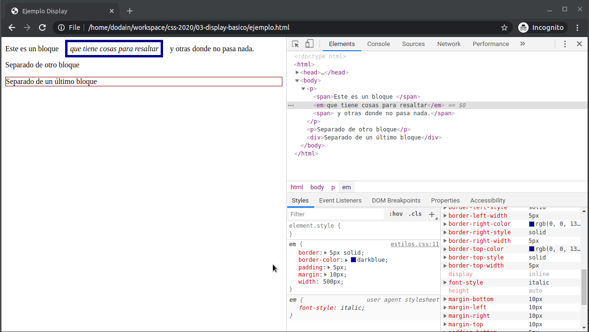

# Ejemplo display

## Configuración del atributo display

En este breve ejemplo vamos a aprender conceptos básicos de posicionamiento y a jugar un poco con ellos.

Veamos el `ejemplo.html` en un navegador:



### Elementos de bloque

Si repasamos la definición de nuestro HTML

```html
  <p>Este es un bloque <em>que tiene cosas para resaltar</em> y otras donde no pasa nada.</p>
  <p>Separado de otro bloque</p>
  <div>Separado de un último bloque</div>
```

vemos que los tres elementos principales son un `<p>` (paragraph) y un `div` (contenedor) y ambos tienen la configuración `display` con el valor `block`, definida por defecto por el navegador o _user agent_.

Un **elemento de bloque** forma justamente un bloque que toma el ancho de su contenedor. Los navegadores insertan un salto de línea entre los elementos anterior y siguiente.

> Recordá que habilitando las herramientas de desarrollador con F12, podés ver el layout de cada elemento.

Los navegadores definen [los siguientes tags HTML](https://developer.mozilla.org/es/docs/Web/HTML/Block-level_elements#Elementos) con la configuración `display: block` por defecto.

### Elementos de línea

Por otra parte, vemos que el tag `<em>` (emphasize, que anteriormente era `<i>`) no define un bloque sino que se ubica en la misma línea que el contenido que está antes y después. La configuración `display: inline` hace que los elementos se ubiquen en forma contigua, respetando la separación adicional que definan padding, border o margin.

Si modificamos la primera línea para agregar elementos `<span>`:

```html
  <p>
    <span>Este es un bloque </span>
    <em>que tiene cosas para resaltar</em>
    <span> y otras donde no pasa nada.</span>
  </p>
```

vemos que no tiene efecto visual: los `<span>`, al igual que el tag `<b>` (bold) y el `<em>` que ya vimos, conforman una sola línea.

### Inline-block

Cambiar el ancho de un elemento con display inline no produce ningún efecto:

```css
em {
  ...
  width: 500px;
}
```

No hace que tome 500 píxeles de ancho. Para que continúe siendo inline pero tome el width que necesitamos, existe una tercera configuración llamada `display: inline-block`.



### None

Si queremos que un elemento no se visualice, lo configuramos con `display: none`. El elemento no ocupará espacio, al contrario de lo que pasa cuando lo definimos como `visibility: hidden`, como nos cuenta [este artículo](https://stackoverflow.com/questions/133051/what-is-the-difference-between-visibilityhidden-and-displaynone).

### Material adicional

- [Display - CSS Tricks](https://css-tricks.com/almanac/properties/d/display/)
- [Block level elements](https://developer.mozilla.org/es/docs/Web/HTML/Block-level_elements)

## Posicionamiento

Por lo general trataremos de que nuestros elementos se dispongan en un layout semi-automático, de manera que un agregado o un cambio en algún elemento no desacomode toda la página, entonces nos alcanzará con modificar la propiedad display (en estas variantes básicas o bien `flex` / `grid` que aprenderemos más adelante). Para algunos otros casos vamos a necesitar configuraciones extras como las que veremos a continuación.

### Position absolute + Z-Index

Podemos jugar un poco con el posicionamiento de elementos de bloque, con las configuraciones `position` y `z-index`:


Al configurar `position: absolute` los dos `<p>` ambos toman una posición exacta en el navegador definidos por los atributos `left` (eje x) y `top` (eje y). ¿Y qué ocurre si colisionan dos bloques? Para eso tenemos la propiedad `z-index`, que define un eje z donde el elemento que tenga un z-index mayor se posicionará por delante del otro.

### Static

Por defecto la posición es **static**, esto significa que un elemento se ubicará en la siguiente línea si tiene el atributo display block, o inmediatamente a la derecha si tiene el atributo display inline (más adelante veremos otras formas de configurar el display). Si queremos modificar las propiedades left, right, top, bottom o z-index, no tiene efecto:


### Relative

Si cambiamos la posición a **relative**, ahora sí comienzan a funcionar las propiedades left, right, top, bottom o z-index:


### Fixed

Y por último, _headers_ o _footers_ de una página conviene definirlos como **fixed**, como vemos en este video (la propiedad bottom lo posiciona al fondo):


Si querés crear un sticky footer podés leer [este artículo](https://css-tricks.com/couple-takes-sticky-footer/).

### Material adicional

Les dejamos material adicional para profundizar:

- [Position - CSS Tricks](https://css-tricks.com/almanac/properties/p/position/)
- [Z-Index - CSS Tricks](https://css-tricks.com/almanac/properties/z/z-index/)
- [Learn Z-Index using a visualization tool](https://thirumanikandan.com/posts/learn-z-index-using-a-visualization-tool)
- [Ejemplo más avanzado con display blocks y jugando con elementos flotantes](https://codepen.io/extragoz/pen/BajJmOZ?editors=1100)
- [CSS Painting Order](https://abandonedwig.info/blog/2020/07/03/css-painting-order.html)
